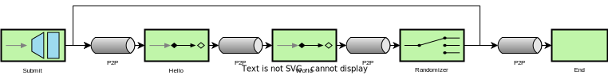

# .NET 7 Implementation of Enterprise Integration Pattern

Following the definition of [EIP (Enterprise Integration Pattern)](https://www.enterpriseintegrationpatterns.com/patterns/messaging)
inspired by the [Spring Integration](https://spring.io/projects/spring-integration).

This Project does not claim complete implementation but best effort - Feel free to help expand the project

## Quick start

The Framework is working with Attributes to build the Integration Flow:

_Example of a flow. A flow could be split over several classes, the different steps are connected by the name of the channels:_
```C#
using EnterpriseIntegration.ChannelAttributes;

public class ExampleFlow001
{
    [ServiceActivator(inChannelId: "hello", outChannelId: "world")]
    public string Hello(string prefix)
    {
        return $"{prefix} hello";
    }

    [ServiceActivator(inChannelId: "world", outChannelId: "random")]
    public string World(string data)
    {
        return $"{data} world";
    }

    [Router(inChannelId: "random")]
    public string Randomizer(string data)
    {
        return Random.Shared.NextInt64() % 2 == 0 ? "hello" : "end";
    }

    [Endpoint(inChannelId: "end")]
    public void End(string data)
    {
        ...
    }
}
```

_Starting the flow by sending a message:_
```C#
using EnterpriseIntegration.Flow;

public class ProductController : Controller
{
    private readonly IMessageGateway _messageGateway;

    // Inject Gateway with Dependency Injection
    public ProductController(IMessageGateway messageGateway)
    {
        _messageGateway = messageGateway;
    }

    public async Task<ActionResult> OrderProduct(Product product)
    {
        // send message to flow for processing
        await _messageGateway.Send("order-product", product);
        return View();
    }
}
```

_Register Enterprise Integration to the ServiceCollection_
```C#
using EnterpriseIntegration;

public void ConfigureServices(IServiceCollection services)
{
    services
        // Register Flows used (so to leverage Dependency Injection)
        .AddSingleton<ExampleFlow001>()
        // Register Enterprise Integration 
        .UseEnterpriseIntegration();
}
```

### Diagram


# Feature overview

| Feature | Status | Description |
| :-- | :--: | :-- |
| [ServiceActivator](https://www.enterpriseintegrationpatterns.com/patterns/messaging/MessagingAdapter.html) | DONE | Allows to define a method which receives and sends a Message. |
| [Router](https://www.enterpriseintegrationpatterns.com/patterns/messaging/MessageRouter.html) | DONE | Allows to define the next channel based on Conditions. |
| [Endpoint](https://www.enterpriseintegrationpatterns.com/patterns/messaging/MessageEndpoint.html) | DONE | Allows to define a method which only receives a Message. |
| [Splitter](https://www.enterpriseintegrationpatterns.com/patterns/messaging/Sequencer.html) | DONE | Allows to split a single Message to several Messages (,to be aggregated again). |
| [Aggregator](https://www.enterpriseintegrationpatterns.com/patterns/messaging/Aggregator.html) | DONE | Allows to aggregate several Messages back into one (after being split).|
| [Filter](https://www.enterpriseintegrationpatterns.com/patterns/messaging/Filter.html) | DONE | Allows to only continue with a subset of Messages |
| [WireTap](https://www.enterpriseintegrationpatterns.com/patterns/messaging/WireTap.html) | DONE | (PRE/POSTAction) Allows to consume Messages without being part of the flow |
| [History](https://www.enterpriseintegrationpatterns.com/patterns/messaging/MessageHistory.html) | DONE | (POSTAction) Allows to Track the History of an Message |
| ErrorHandling | DONE | Exceptions are forwarded to an ErrorChannel |
| InMemoryChannel | DONE | Channel for passing messages in the same application |
| RabbitMQChannel | DONE | Channel for passing messages via [RabbitMQ](https://www.rabbitmq.com/) queues |
| KafkaChannel | DONE | Channel for passing messages via [Kafka](https://www.confluent.io/lp/apache-kafka) topics |
| Resilience(Retry) | TODO | When a message cannot be published to a channel (e.g. QueueSystem down, network issues), it will automatically retried. |
| PollingActivator | TODO | Framework to define a flow step, which executes an polling algorithm till it returns an expected return |

## Components

### ServiceActivator

The ServiceActivator allows to activate/execute service from within the flow. This is the basic use case to execute code or call other services as part of a flow.

```C#
[ServiceActivator(inChannelId: "register-user", outChannelId: "handle-register-user-result")]
public UserRegistrationResult Register(User user)
{
    return UserService.Register(user);
}
```

The FlowEngine tries to map the provided payload to the parameters of the attributed method. In addition to just expecting the payload, it's also possible to expect
the message headers and/or the message itself. Modifications to the message headers will be forwarded to further flow nodes.


```C#
[ServiceActivator(inChannelId: "register-user", outChannelId: "handle-register-user-result")]
public UserRegistrationResult Register(IMessage<User> userMessage)
{
    return UserService.Register(userMessage.Payload);
}
```

```C#
[ServiceActivator(inChannelId: "register-user", outChannelId: "handle-register-user-result")]
public user Authenticate(User user, IMessageHeaders headers)
{
    headers.Add("token", UserService.Authenticate(user));
    return user;
}
```

### Router

A Router allows to route messages to different channels by evaluating any condition. The as router defined method, can
execute any code and *must* at the end return a ChannelId, to where the originial message/payload is to be sent to.

```C#
[Router(inChannelId: "route-user-exists")]
public ChannelId RouteUserExists(User? user)
{
    return new ChannelId(user != null ? "set-user" : "load-user");
}
```

#### Built-In Router

The Framework comes with a predefined Router, which routes to a Channel provided in the headers.

```C#
using EnterpriseIntegration.Channels;

[Router(inChannelId: "load-users", outChannelId: EngineChannels.RouteByHeaderChannel)]
public async Task<User> LoadUser(string userId, IMessageHeaders headers)
{
    headers.RouteToChannel = new ChannelId(user != null ? "set-user" : "load-user");
    return await UserService.LoadUser(userId);
}
```
### Endpoint

Endpoints are similar to ServiceActivator but are intended to be placed at the end of the flow, and therefor do not
provide a outChannelId.

```C#

[Endpoint(inChannelId: "complete-user-creation")]
public async Task CompleteUserCreation(string userId)
{
    await UserService.SetUserActive(userId);
}
```

### Splitter

Splitter allow to generate multiple follow up messages from a single message, these can later be aggregated with an Aggregator to complete the complete flow
with a single message.

A Splitter adds meta information to the headers, to be used by an Aggregator to wait for completion of all sent messages.

```C#
[Splitter(inChannelId: "process-complete-order", outChannelId: "process-single-item")]
public IEnumerable<OrderItem> ProcessOrder(Oder order)
{
    return order.Items;
}
```

### Filter

Filter allows to stop some messages from the flow. This might be helpful as a part of a Splitter.


```C#
[Filter("filter", "next-channel")]
public FilterResult OnlyForwardWhenEnoughCash(Message message)
{
    return message.Cash >= Cost ? FilterResult.Forward : FilterResult.Discard;
}
```

### Aggregator

Aggregator wait for all/enough messages to be arrived, before processing them all. Waiting for all messages requires a MessageStore, where the messages
can be stored, while waiting for others to arrive. In a setup with multiple apps, it is important to have a MessageStore which is shared over all instances.


```C#
[Aggregator("aggregate-completed-items", "complete-order")]
public CompleteOrder AggregateOrder(IEnumerable<CompleteOrderItem> completeOrderItem)
{
    return OrderService.CompleteOrder(completeOrderItem);
}
```

### WireTap

WireTaps are used to listen to Messages without interrupting the Flow (for testing/debugging).

```C#
// to be injected by dependency injection
IWireTapService wireTapService

IMessage result = null;
// first parameter: name of the channel to be tapped
// second parameter: method to be executed, when a message arrives (in this example it stores the message in a variable)
WireTapId id = _wireTapService.CreateWireTap("name_of_channel", async msg => result = msg);

...

// remove the wiretap, when you are finished, to reduce overhead.
_wireTapService.RemoveWireTap(id);
```

## Channels

[EIP: Messaging Channels](https://www.enterpriseintegrationpatterns.com/patterns/messaging/MessagingChannelsIntro.html) are responsible to transport messages between the
different components of the Enterprise Integration Pattern. The default channel used, is an InMemoryChannel invoking other components in the same application. By replacing
such a channel with another implementations (e.g. RabbitMQ), distribution of different applications can be achieved.

### InMemoryChannel
see: [EIP: Point to Point Channel](https://www.enterpriseintegrationpatterns.com/patterns/messaging/PointToPointChannel.html)

Is an InMemoryChannel allowing to connect two endpoints with eachother. The channel is One-to-One connection, directly moving the return value of one endpoint
to the next endpoint.

This is the default channel type and also the fallback, if a channel is requested (for sending or receiving) and no channel has been previously registered, a new 
InMemoryChannel will be created.

### RabbitMQChannel (AMQP)

Provides a simple channel implementation using [RabbitMQ](https://www.rabbitmq.com/).

Registration of RabbitMQ
```C#
using EnterpriseIntegation.RabbitMQ;
using Microsoft.Extensions.Configuration;
using Microsoft.Extensions.DependencyInjection;
using System;
using System.IO;

namespace EnterpriseIntegration.RabbitMQ.Tests;
public class Startup
{
    public void ConfigureServices(IServiceCollection services)
    {
        IConfigurationBuilder configBuilder = new ConfigurationBuilder()
            .SetBasePath(Directory.GetCurrentDirectory())
            .AddJsonFile("appsettings.json");
        IConfiguration config = configBuilder.Build();

        services
            .AddSingleton<ServiceActivatorFlow001>()
            // Enable RabbitMQ Messaging based on json config
            .WithRabbitMQMessaging(config)
            // Provide the channel "001_world" via RabbitMQ
            .WithRabbitMQChannel("001_world")
            .UseEnterpriseIntegration();
    }
}
```

The Registration of a RabbitMQChannel can be configured with additional parameters of the registration method.

### KafkaChannel

Provides a simple channel implementation using [Kafka](https://kafka.apache.org/).

Registration of Kafka
```C#
using EnterpriseIntegation.Kafka;
using Microsoft.Extensions.Configuration;
using Microsoft.Extensions.DependencyInjection;
using Xunit.DependencyInjection.Logging;

namespace EnterpriseIntegration.Kafka.Tests;
public class Startup
{
    public static void ConfigureServices(IServiceCollection services)
    {
        IConfigurationBuilder configBuilder = new ConfigurationBuilder()
            .SetBasePath(Directory.GetCurrentDirectory())
            .AddJsonFile("appsettings.json");
        IConfiguration config = configBuilder.Build();

        services
            .AddSingleton<ServiceActivatorFlow001>()
            // Enable Kafka Messaging based on json config
            .WithKafkaMessaging(config)
            // Provide the channel "001_world" via Kafka and will try to create the topic if it doesn't exist already
            .WithKafkaChannel("001_world", c => c.EnsureCreated = true)
            .UseWireTap()
            .UseEnterpriseIntegration();
    }
}
```

The Registration of a KafkaChannel can be configured with additional parameters of the registration method.

Example of the configuration for Kafka (it leverages the base kafka config, so all kafka configs are possible).
```JSON
{
  "EnterpriseIntegration": {
    "Kafka": {
      "ConsumerConfig": {
        "BootstrapServers": "127.0.0.1:29092",
        "GroupId": "integration-test"
      },
      "ProducerConfig": {
        "BootstrapServers": "127.0.0.1:29092"
      }
    }
  }
}
```

# Errors

## Immediate Error Handling

If an Error/Exception happens immediately after handing a Message is pushed through the MessageGateway the Exception will be thrown to the calling Thread/Method.
As soon as the first receiver handled the message, or the message has been pushed to an external channel (Kafka, RabbitMQ...) the flow handles the exception by forwarding
it to the error channel.

## Flow Error Handling / Error Channel

If an Error/Exception happens during the flow, the FlowEngine catches the exception and forwards it to an error channel. The error channel can be defined via the 
message headers - if no error channel is defined, the default error channel is used; with the behaviour to log the exception.

```C#
IMessageHeaders headers = new MessageHeaders();
headers.WithErrorChannel("custom-error-channel");
IMessage message = new GenericMessage<ExamplePayload>(headers, ExamplePayload.CreateRandom());

await _messageGateway.SendMessage("flow-entry", message);
```

## Common Errors

Common Errors and how to fix them:

| Exception | How to solve |
| :--- | :--- |
| TooManyPayloadParameters | The method used as a flow node receiver has too many "payload" parameters. A method should have only one `value` parameter, which could be either any type or a parameter of type `IMessage<>`. In addition it is possible to have an `IMessageHeaders` injected. |
| PayloadTransformation | The payload of a message did not match the parameter defined in the receiving method. Change the return type of the sending message, or change the parameter of the receiving message |

# Architecture

# Tests

## Unit Tests

## Integration Tests

Integration Tests are using xUnit Dependencies to setup real applications with proper ServiceCollections to test the flows. 
Tests for Channels (e.g. RabbitMQ) are using Docker Images (Setup with [FluentDocker](https://github.com/mariotoffia/FluentDocker)) for testing.

## Load Tests

Load Tests are setup with [NBomber](https://nbomber.com/) to run scenarios and measure their execution time. To make the starting
and usage of the console app, the Framework [Cocona](https://github.com/mayuki/Cocona) has been used, to give a nice CLI feeling.

### Publish Load Tests

To run the Load tests the must be published

```Powershell
# generating a OS agnostic output
mkdir loadtests
cd loadtests
dotnet publish ..\tests\EnterpriseIntegration.LoadTests --output .
```

### Run Load Tests

To execute the Load tests the published artifact can be started with a scenario parameter.
```Powershell
# running load test for simple scenario
EnterpriseIntegration.LoadTests.exe --scenario Simple
```

the report is by default generated into the folder _reports_